## 1.安装apk到手机

## 2.打开app,点击菜单按钮

## 3.点击菜单中的设置选项
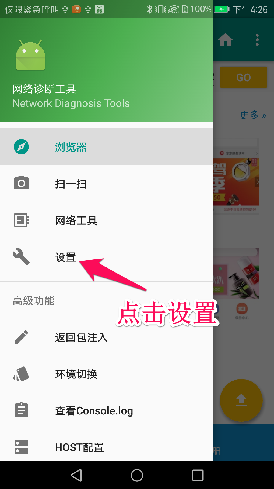
## 4.安装安全证书
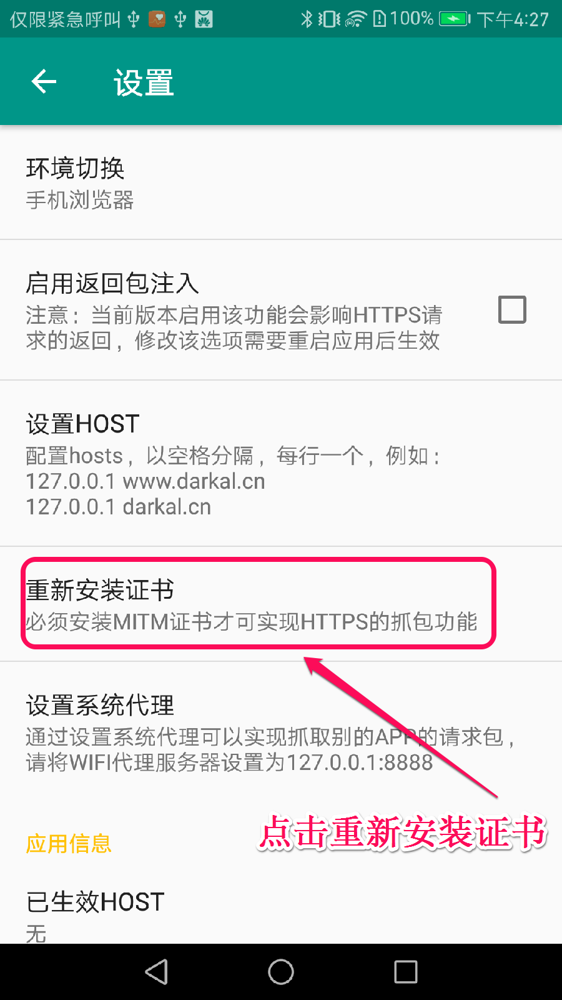
## 5.退出应用后，重新启动应用
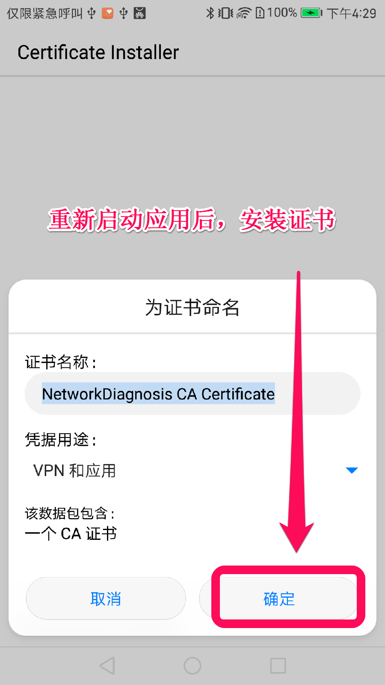
## 6.证书安装成功

## 7.输入手机端商城地址点击go

## 8.打开菜单点击查看日志
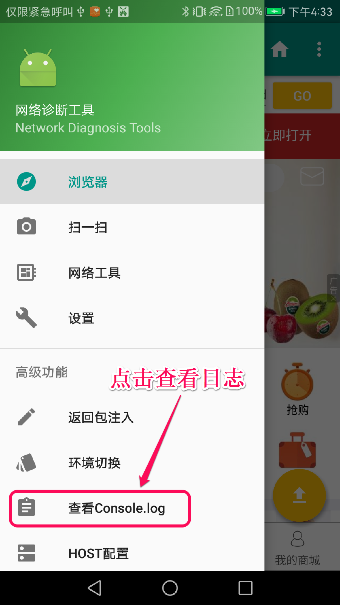
## 9.点击确定
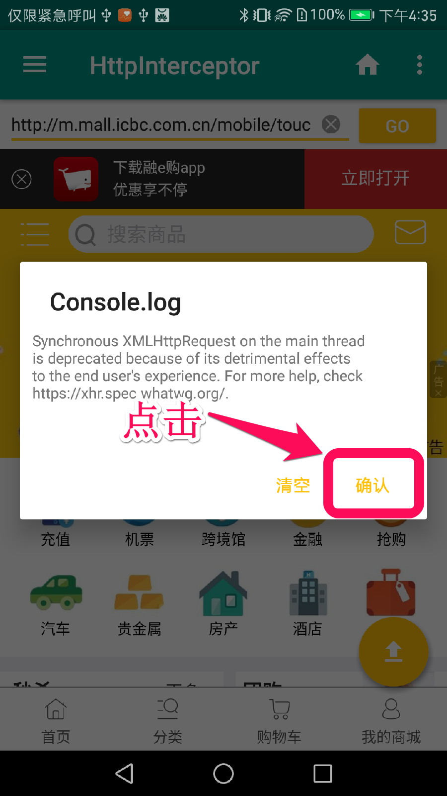

## 10.点击右下角按钮
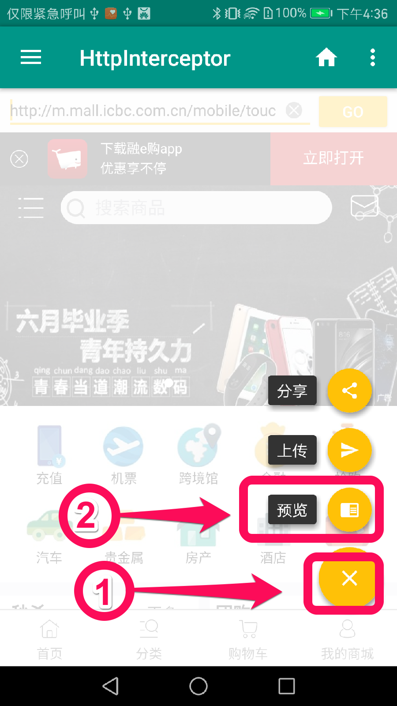

## 11.点击预览后显示日志
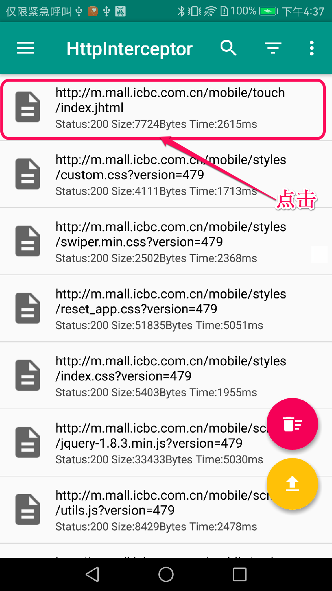

## 12.点击第一条日志查看详情
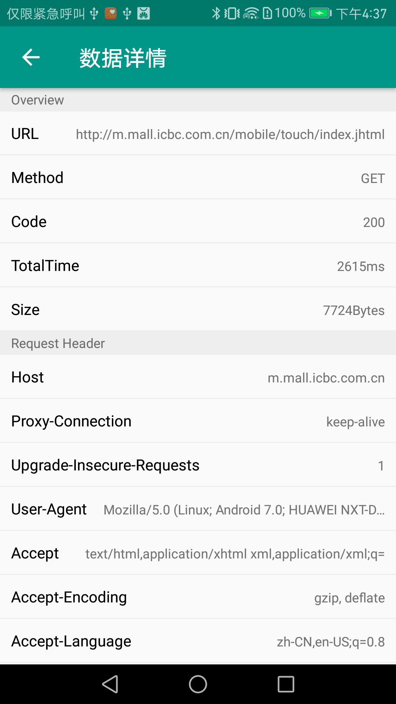
## 13.点击报后Content查看返回内容
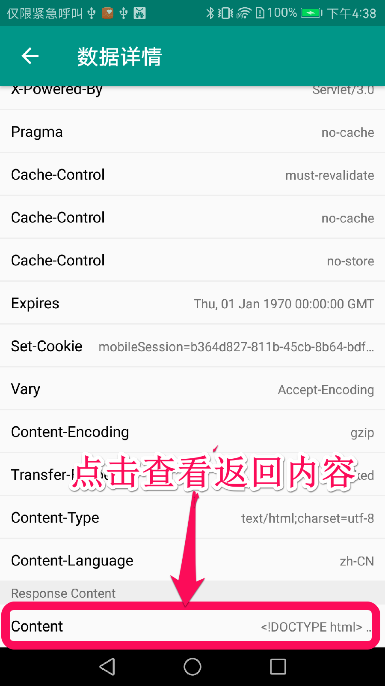
## 14.显示请求返回的详情
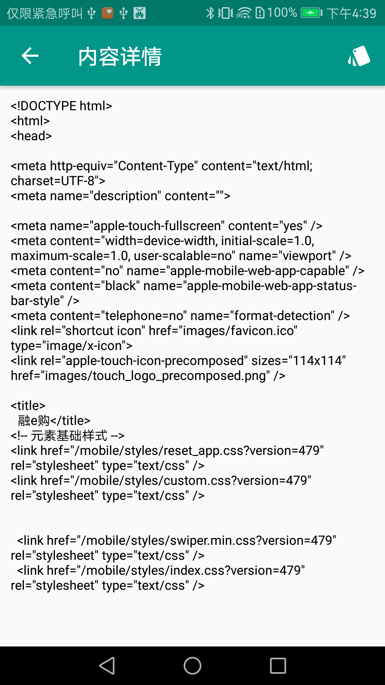

# 设置代理
## 15.设置界面长按已经连接wifi
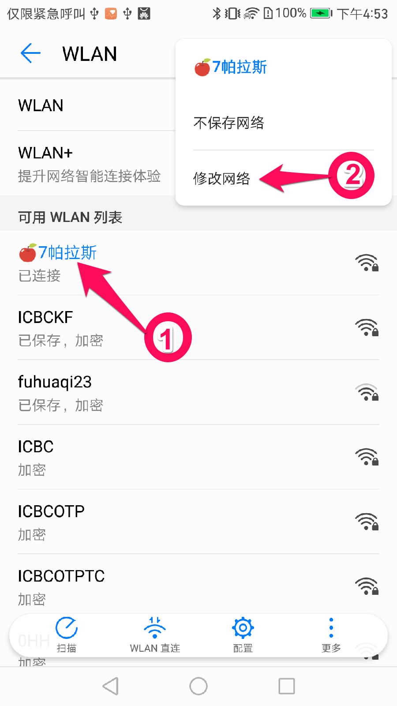

## 16设置wifi代理
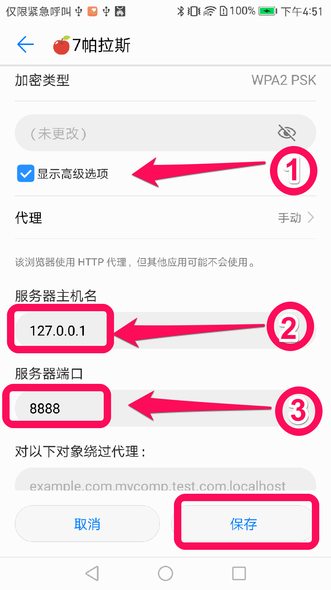

## 17.打开融e购进入首页

## 18.查看融e购首页拦截
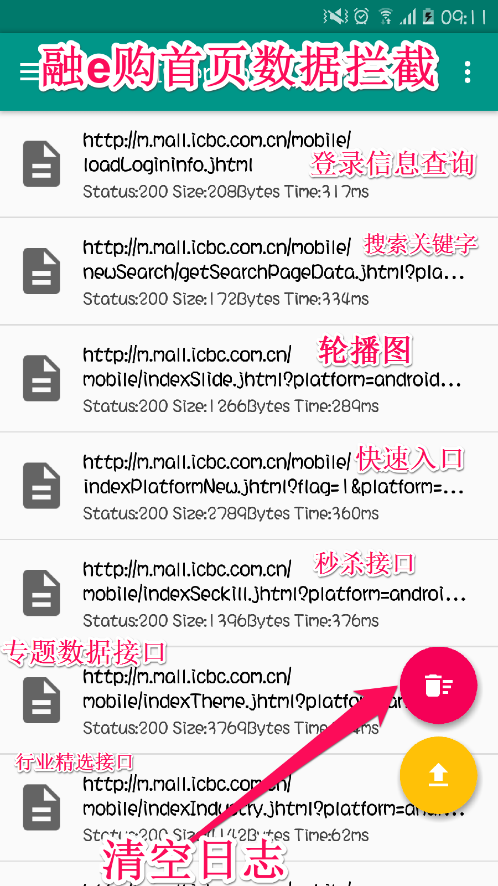