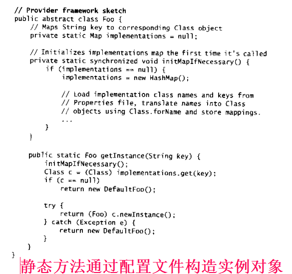
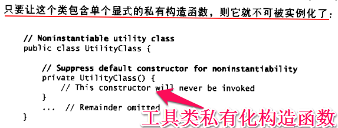

# Effective Java
## 引言
新模式：Finalizer Guardian(终结函数守卫者)，Defensive readResolve（保护性的readResolve方法）

本书中大部分内容都不是讨论性的，而是关心如何编写出清晰，正确，可用，健壮，灵活和可维护的程序来。

Java语言支持四种类型：接口（interface）,类（class）,数组（array）和**原语类型（primitive）**.前三通常称为引用类型（reference）,类的实例和数组是对象（object）,而原主类型值不是对象。一个类的成员（member）包括域（field）,方法（method），成员类（member class）和成员接口（member interface）。一个方法的原型（signature）包括它的名字和所有形参的类型，方法原型不包括它的返回类型。

**注**：原语类型就是int boolean long....等等一些不是对象不是类的类型,所谓“原语”,可以理解为原始的数据类型,没有什么方法可以调用

## 创建和销毁对象
什么时候，如何创建对象；什么时候，如何避免创建对象；如何保证对象能够适时地销毁；对象被销毁之前如何管理各种清理工作。
### 第1条：考虑用静态工厂方法代替构造函数
类可以提供一个公有的静态工厂方法（static factory method）,所谓静态工厂方法，实际上只是一个简单的静态方法，它返回的是类的一个实例。

**静态工厂方法的一个好处是，与构造函数不同，静态工厂方法具有名字**可以进行明确的描述被返回的对象，更易于使用，阅读！


**静态工厂方法的第二个好处是，与构造函数不同，它们每次被调用的时候，不要求非得创建一个新的对象。**避免创建不必要的重复对象

**静态工厂方法的第三个好处是，与构造函数不同，它们可以返回一个原返回类型的子类型的对象**，这样我们在选择被返回对象的类型时就有了更大的灵活性。这样一个api可以返回一个对象，同时又不使该对象的类成为公有的，这项技术非常适合于基于接口的框架结构，因为这样的框架结构中，接口成为静态工厂方法的自然返回类型。

静态工厂方法返回的对象所属的类，在编写包含该静态工厂方法的类时可以并不存在，这种灵活的静态工厂方法构成了服务提供者框架（service provider framework）的基础。

在Properties文件中有字符串键（String key)映射到对应类名，客户端使用静态工厂方法的时候把字符串键作为参数传进去，静态工厂方法在一个映射表中查找class对象，然后使用Class.newInstance方法实例化这个类：


**静态工厂方法缺点**如果不含公有或者受保护的构造函数，就不能被子类化

**静态工厂方法缺点**不会像构造函数那样被明确的标示出来 ，并且化工厂一种对规范的背离

总的来说，静态工厂方法和公有的构造函数都有它们各自的用途，我们需要理解它们各自的长处。要避免一上来就提供构造函数，而不考虑静态工厂。因为静态工厂通常更加合适。如果 你正在权衡这两种选择，又没有其他 因素强烈地影响你的选择，那么你最好还是简单地使用构造函数，毕竟这是语言提供的规范。


### 第2条使用私有构造函数化singleton属性

singletom通常被用来代表那些本质上具有惟一性的系统组件，比如视频显示或者文件系统。
方法一：
```
public static final Singleton INSTANCE = new Singleston();
```
好处：组成类的成员的声明很清楚地表明了这个类是一个Singleton；公有的静态域是final的，所以问题包含相同的对象引用，性能上稍微领先
方法二：
```
private static final Singleton INSTANCE = new Singleston();

public static Singleton getInstance(){
	return INSTANCE;
}
```
好处：提供了灵活性，在不改变api的前提下，允许我们改变想法，把该类做成singleton，或者不做成singleton，容易被修改。

为了使一个singleton类变成 可序列化的(serializable)，仅仅在声明中加上“implements Serializable“是不够的，为了维护singleton性，你必须也要提供一个readResolve方法，否则的话，一个序列化的时候，都会导致创建一个新的实例。

**注**：序列化就是将一个对象的状态（各个属性量）保存起来，然后在适当的时候再获得。
　　序列化分为两大部分：序列化和反序列化。序列化是这个过程的第一部分，将数据分解成字节流，以便存储在文件中或在网络上传输。反序列化就是打开字节流并重构对象。对象序列化不仅要将基本数据类型转换成字节表示，有时还要恢复数据。恢复数据要求有恢复数据的对象实例
　　序列化的什么特点：
　　如果某个类能够被序列化，其子类也可以被序列化。声明为static和transient类型的成员数据不能被序列化。因为static代表类的状态， transient代表对象的临时数据。
  
 transient这个关键字，它的意思是临时的，即不会随类一起序列化到本地，所以当还原后，这个关键字定义的变量也就不再存在。
 
 [序列化及transient使用](http://www.jb51.net/article/60754.htm)
 
 ### 第3条通过私有构造函数强化不可实例化能力
 
**企图通过将一个类做成抽象类来强制该类不可被实例化是行不通的**


### 第4条 避免创建重复对象
重复使用同一个对象，而不是每次需要的时候就创建一个功能上等价的新对象，如果 一个对象是非可变的（immutable），那么总是可以被重用。
```
String s = new String("shenjianli"); //don't do this
String s = "shenjinali";//do this
```
**迟缓初始化**  
### 第5条 消除过期的对象引用
过期引用是指永远也不会再被解除的引用

在java中，内存泄漏是很隐蔽的，如果一个对象引用被无意识地保留起来了，那么垃圾回收机制不仅不会处理这个对象，而且也不会处理被这个对象所引用其他对象，即使只有少量的几个对象引用被无意识地保留下来，也会有很多的对象被排除在垃圾回收机制之外，从而对性能造成潜在的重大影响。

清空过期引用的好处是，如果神经病人 在以后又被错误地解除引用，则程序会立即抛出空指针异常。

**何时应该清空一个引用？**
一般而言，只要一个类自己管理它的内存，程序员就应该警惕内存泄漏问题，一旦一个元素释放，则元素中包含的任何对象引用应该要被清空。

内存泄漏的另一个常见来源是缓存，一旦一个对象引用放到缓存中，它就容易被遗忘掉，从而使它不同有用之后很长一段时间内仍然在缓存中。
**解决方法**：

1.使用**WeakHashMap**来代表缓存，当缓存中的条目过期之后，它们会自动被删除。

2.后台线程来不定时的清除无用的缓存。可用**LinkedHashMap**类

### 第6条 避免使用终结函数
在java中，当一个对象不可到达的时候，垃圾回收会回收与该对象相关联的存储空间。
不要被System.gc和System.runFinalization方法所诱惑。

显式的终止方法通常与try finally结构结合使用，以保证及时终止。
finalize
**Java中final、finally、finalize的区别？**
final java中的关键字用于声明属性，方法和类，分别表示属性不可交变，方法不可覆盖，类不可继承。
finally java的一种异常处理机制是异常处理语句结构的一部分，表示总是执行。
finalize  Java中的一个方法名。是Object类的一个方法，在垃圾收集器执行的时候会调用被回收对象的此方法，供垃圾收集时的其他资源回收，例如关闭文件等。