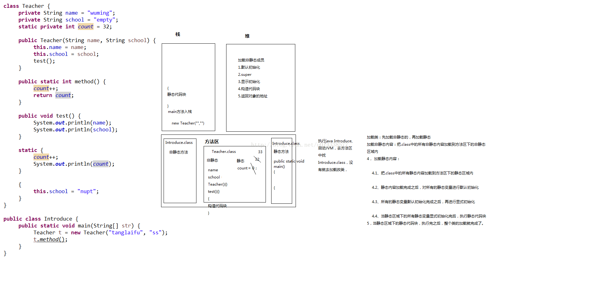

# interview
## 1.类加载过程及对象创建过程
### 1.1 类加载过程：
1， JVM会先去方法区中找有没有相应类的.class存在。如果有，就直接使用；如果没有，则把相关类的.class加载到方法区
2， 在.class加载到方法区时，会分为两部分加载：先加载非静态内容，再加载静态内容
3， 加载非静态内容：把.class中的所有非静态内容加载到方法区下的非静态区域内
4， 加载静态内容：
    4.1、把.class中的所有静态内容加载到方法区下的静态区域内
    4.2、静态内容加载完成之后，对所有的静态变量进行默认初始化
    4.3、所有的静态变量默认初始化完成之后，再进行显式初始化
    4.4、当静态区域下的所有静态变量显式初始化完后，执行静态代码块
5，当静态区域下的静态代码块，执行完之后，整个类的加载就完成了。
 
### 1.2 对象创建过程：
1， 在堆内存中开辟一块空间

2， 给开辟空间分配一个地址

3， 把对象的所有非静态成员加载到所开辟的空间下

4， 所有的非静态成员加载完成之后，对所有非静态成员变量进行默认初始化

5， 所有非静态成员变量默认初始化完成之后，调用构造函数

6， 在构造函数入栈执行时，分为两部分：先执行构造函数中的隐式三步，再执行构造函数中书写的代码
    
    6.1、隐式三步：
        1，执行super语句
        2，对开辟空间下的所有非静态成员变量进行显式初始化
        3，执行构造代码块
    6.2、在隐式三步执行完之后，执行构造函数中书写的代码
7，在整个构造函数执行完并弹栈后，把空间分配的地址赋值给一个引用对象
### 总结类中能书写的成员

栈： 用来运行函数。可以存储局部信息

特点：先进后出

堆：用来存储实体（被new创建出来的）。

特点：
	
	1，  每一个实体所开辟的空间都有一个地址

	2，  每一个实体中存储的数据都有一个默认初始值

方法区：

存放class和static。 方法区其实是由N多个小的区域构成。有存放非静态内容的非静态区域，还有存放静态内容的静态区域，还有存放常量的常量池等
### 图解创建过程


### 代码注释创建过程

```
class Person {  
    int age;  
  
    Person(int age) {  
        this.age = age;  
    }  
}  
  
class Student extends Person {
	// 1, 非静态成员加载完成之后，对所有非静态成员变量进行默认初始化
	// String school = null;	
	// 3，对开辟空间下的所有非静态成员变量进行显式初始化  
    String school = "abc";  
  
    Student(String school, int age) {  
        // 2，执行super语句  
        super(age);  
        // 5、在隐式三步执行完之后，执行构造函数中书写的代码  
        this.school = school;  
    }  
  
    {  
        // 4，执行构造代码块  
        System.out.println("Student code block");  
    }  
}  
```

### 类的组成
```
class  ABC
{
         非静态成员变量
         静态成员变量
 
        非静态成员函数
        静态成员函数
 
构造函数：ABC(...){...}
 
静态代码块： static {...}
构造代码块 :  {...}
}
```
## 2.栈堆内存
### 栈：
保存局部变量的值，包括：1.用来保存基本数据类型的值；2.保存类的实例，即堆区对象的引用(指针)。也可以用来保存加载方法时的帧。
### 堆：
用来存放动态产生的数据，比如new出来的对象。注意创建出来的对象只包含属于各自的成员变量，并不包括成员方法。因为同一个类的对象拥有各自的成员变量，存储在各自的堆中，但是他们共享该类的方法，并不是每创建一个对象就把成员方法复制一次。

无非就是两种类型的变量：基本类型和引用类型。二者作为局部变量，都放在栈中，基本类型直接在栈中保存值，引用类型只保存一个指向堆区的指针，真正的对象在堆里。作为参数时基本类型就直接传值，引用类型传指针。


### 小结
1.分清什么是实例什么是对象。Class a= new Class();此时a叫实例，而不能说a是对象。实例在栈中，对象在堆中，操作实例实际上是通过实例的指针间接操作对象。多个实例可以指向同一个对象。

2.栈中的数据和堆中的数据销毁并不是同步的。方法一旦结束，栈中的局部变量立即销毁，但是堆中对象不一定销毁。因为可能有其他变量也指向了这个对象，直到栈中没有变量指向堆中的对象时，它才销毁，而且还不是马上销毁，要等垃圾回收扫描时才可以被销毁。

3.以上的栈、堆、代码段、数据段等等都是相对于应用程序而言的。每一个应用程序都对应唯一的一个JVM实例，每一个JVM实例都有自己的内存区域，互不影响。并且这些内存区域是所有线程共享的。这里提到的栈和堆都是整体上的概念，这些堆栈还可以细分。

4.类的成员变量在不同对象中各不相同，都有自己的存储空间(成员变量在堆中的对象中)。而类的方法却是该类的所有对象共享的，只有一套，对象使用方法的时候方法才被压入栈，方法不使用则不占用内存。


```
public class test {  
    public static void main(String[] args) {      
        objPoolTest();  
    }  
  
    public static void objPoolTest() {  
        int i = 40;  
        int i0 = 40;  
        Integer i1 = 40;  
        Integer i2 = 40;  
        Integer i3 = 0;  
        Integer i4 = new Integer(40);  
        Integer i5 = new Integer(40);  
        Integer i6 = new Integer(0);  
        Double d1=1.0;  
        Double d2=1.0;  
          
        System.out.println("i=i0\t" + (i == i0));  
        System.out.println("i1=i2\t" + (i1 == i2));  
        System.out.println("i1=i2+i3\t" + (i1 == i2 + i3));  
        System.out.println("i4=i5\t" + (i4 == i5));  
        System.out.println("i4=i5+i6\t" + (i4 == i5 + i6));      
        System.out.println("d1=d2\t" + (d1==d2));   
          
        System.out.println();          
    }  
}  
```
结果：
```
i=i0    true  
i1=i2   true  
i1=i2+i3        true  
i4=i5   false  
i4=i5+i6        true  
d1=d2   false
```


### 结果分析：
1.i和i0均是普通类型(int)的变量，所以数据直接存储在栈中，而栈有一个很重要的特性：栈中的数据可以共享。当我们定义了int i = 40;，再定义int i0 = 40;这时候会自动检查栈中是否有40这个数据，如果有，i0会直接指向i的40，不会再添加一个新的40。

2.i1和i2均是引用类型，在栈中存储指针，因为Integer是包装类。由于Integer包装类实现了常量池技术，因此i1、i2的40均是从常量池中获取的，均指向同一个地址，因此i1=12。

3.很明显这是一个加法运算，Java的数学运算都是在栈中进行的，Java会自动对i1、i2进行拆箱操作转化成整型，因此i1在数值上等于i2+i3。

4.i4和i5均是引用类型，在栈中存储指针，因为Integer是包装类。但是由于他们各自都是new出来的，因此不再从常量池寻找数据，而是从堆中各自new一个对象，然后各自保存指向对象的指针，所以i4和i5不相等，因为他们所存指针不同，所指向对象不同。

5.这也是一个加法运算，和3同理。

6.d1和d2均是引用类型，在栈中存储指针，因为Double是包装类。但Double包装类没有实现常量池技术，因此Doubled1=1.0;相当于Double d1=new Double(1.0);，是从堆new一个对象，d2同理。因此d1和d2存放的指针不同，指向的对象不同，所以不相等。

### 小结：
1.以上提到的几种基本类型包装类均实现了常量池技术，但他们维护的常量仅仅是【-128至127】这个范围内的常量，如果常量值超过这个范围，就会从堆中创建对象，不再从常量池中取。比如，把上边例子改成Integer i1 = 400; Integer i2 = 400;，很明显超过了127，无法从常量池获取常量，就要从堆中new新的Integer对象，这时i1和i2就不相等了。
2.String类型也实现了常量池技术，但是稍微有点不同。String型是先检测常量池中有没有对应字符串，如果有，则取出来；如果没有，则把当前的添加进去。


### Java堆内存(heap memory)的十个要点

1. Java堆内存是操作系统分配给JVM的内存的一部分。

2. 当我们创建对象时，它们存储在Java堆内存中。

3. 为了便于垃圾回收，Java堆空间分成三个区域，分别叫作New Generation, Old Generation或叫作Tenured Generation，还有Perm Space。

4. 你可以通过用JVM的命令行选项 -Xms, -Xmx, -Xmn来调整Java堆空间的大小。不要忘了在大小后面加上”M”或者”G”来表示单位。举个例子，你可以用 -Xmx256m来设置堆内存最大的大小为256MB。（Xms表示起始的堆内存大小，Xmx表示最大的堆内存的大小。另外有一个参数 -Xmn，它表示new generation的大小）

5. 你可以用JConsole或者 Runtime.maxMemory(), Runtime.totalMemory(), Runtime.freeMemory()来查看Java中堆内存的大小。

6. 你可以使用命令“jmap”来获得heap dump，用“jhat”来分析heap dump。

7. Java堆空间不同于栈空间，栈空间是用来储存调用栈和局部变量的。

8. Java垃圾回收器是用来将死掉的对象(不再使用的对象)所占用的内存回收回来，再释放到Java堆空间中。

9. 当你遇到java.lang.outOfMemoryError时，不要紧张，有时候仅仅增加堆空间就可以了，但如果经常出现的话，就要看看Java程序中是不是存在内存泄露了。

10. 请使用Profiler和Heap dump分析工具来查看Java堆空间，可以查看给每个对象分配了多少内存。


http://www.jianshu.com/p/251b1bf72cd8

