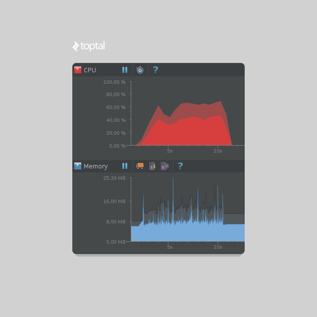
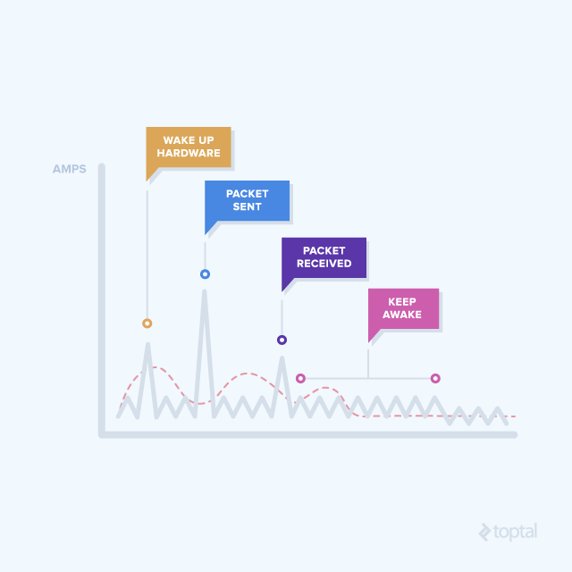

欢迎使用 **{小书匠}(xiaoshujiang)编辑器**，您可以通过==设置==里的修改模板来改变新建文章的内容。

## 提高性能重要性
Android设备提供了许多核心API方法，所以很多人认为，开发一款流畅的高质量的Android应用程序来说都是一项简单的任务，的确是这样么？ 当然不是如此。 由于Android应用上的好多功能都可以通过许多不同的方法来实现，因此选择最佳实现方法就会变得很困难。 如果你想选择最有效的方法，你必须知道使用各种方法将会在应用程序引发什么。 幸运的是，你不必依靠你的感觉或嗅觉，因为有很多工具可以通过测量和描述发生什么来帮助你了解引发了什么，从而找出最有效的方法。使用最有效的方法将会优化和使你的应用更加流畅，这也将会极大地改善用户体验，同时也可以减少电量的损耗。

让我们来看一组数据，以便我们更加深刻的认为Android应用优化的重要性，根据Nimbledroid的统计，由于Android应用性能不佳，86％的用户（包括我）在使用一次应用后就卸载了该应用，并且以后也不会再安装此应用。如果你的应用需要加载一些内容，你必须在11秒内完成界面的显示，否则没有任何用户会继续等待。因为这个，你的应用可能在各大应用市场上会得到很多不好的评论。


挑战用户耐心是App用户流失关键因素，挑战用户耐心是应用卸载的快捷方式，挑战用户耐心是Android应用死亡的必然趋势。

对于Android应用来说，每个用户第一次感知的就是应用的启动时间。 根据另一项Nimbledroid的统计，在100个流行应用程序中，有40个应用在2秒内启动，70个应用在3秒内启动。 因此，如果可能，你应该尽快启动应用，并把后台检查和更新尽量后延一点。

永远记住，过早优化是所有邪恶的根源。 您也不应该浪费太多时间在那些小优化， 您应该把更多的精力用于那些经常调用的代码优化优化上，这样你将会体会到优化的效益。 例如，经常运行的代码包括onDraw()函数，理想情况下onDraw()函数每秒会调用60次。 绘图是最慢的操作，所以在界面上尽量只重绘你需要重绘的区域。关于onDraw()重绘，后面将会进一步进行详述。

## 性能诀窍
足够的理论说明，我们应该考虑Android应用的性能。如果你想开发出高性能的Android应用，这里列出了一些你应该考虑的事情。
### 1.String与StringBuilder
假设你开发中使用一个String，并且由于某种原因，你想要拼接更多的String到一起，如拼接一万个字符串到一个字符串。 代码可能看起来像这样：
```
String string = "hello";
for (int i = 0; i < 10000; i++) {
    string += " world";
}
```
在Android Studio监视器上，你可以看到这种字符串的拼接是如何的低效，并伴有大量垃圾回收（GC）的触发。



这段代码在我相当不错的手机（Android 5.1.1）上使用了大约8秒，实现同样功能的更有效的方法是使用StringBuilder。如下：
```
StringBuilder sb = new StringBuilder("hello");
for (int i = 0; i < 10000; i++) {
    sb.append(" world");
}
String string = sb.toString();
```
在同一台设备上，这种方法几乎瞬间（不到5ms）就完成了字符拼接。 CPU和内存监视图几乎完全平滑，所以你可以想象这个改进有多大。 请注意，为了比较String与StringBuilder的性能差异，我们假设1万个字符串进行拼接，但这种情况日常开发不会经常遇到的。 所以如果仅仅是进行两个字符串的拼接，你使用StringBuilder将看不到任何改进。 顺便说一句，如果你使用下面代码：
```
String string = "hello" + " world";
```
它将会内部转换为StringBuilder，然后再进行拼接。
你可能想知道，为什么使用String直接拼接会这么慢呢？ 这是由于字符串是不可变的，所以一旦创建，它们就不能被改变。 即使你认为你正在更改String的值，实际上你是用新值创建一个新的String。
例如，下面代码：
```
String myString = "hello";
myString += " world";
```
在内存中存在的不是1个字符串“你好世界”，而是2个字符串。 String myString将如你所料值为“hello world”。 但是，原来的值为“hello”的字符串仍然存在，其没有任何引用所引用，静静地等待被垃圾收集。 这也是您应该将密码存储在字符数组而不是字符串中的原因。 如果您将密码存储为字符串，它将以可读取的格式保留在内存中，直到下一个GC无法预测的时间长度。 回到上面描述的不变性，即使你在使用它之后再分配一个值，String也会留在内存中。 但是，如果您在使用密码后清空该字符数组，它将永远地彻底消失。

### 2.选择正确的数据类型
在开始编写代码之前，您应该决定使用那种集合类型。 例如，您应该使用Vector还是ArrayList呢？ 这取决于你的逻辑需求。 如果您需要的是线程安全的集合，也就是说在某一时刻，只允许一个线程使用它，这时您应该选择Vector，因为它是同步的。 在其他情况下，你应该坚持选择ArrayList，除非你有特别的原因需要使用向量。

当你想要使用单例对象的集合时，情况如何？ 那么你应该选择Set。 它被设计为不可包含重复对象，因此你不必自行处理重复对象。 有多种类型的集合，所以选择一个适合您使用的。 如果你需要一组唯一的对象，你可以使用HashSet。 如果要保留插入对象的顺序，你可以选择LinkedHashSet。 TreeSet会自动对对象进行排序，因此你不必再额外调用其他任何排序方法。 它也应该会有效地进行排序，而不必考虑排序算法。

```
Rob Pike的5个编程规则之一：数据占主导地位。 如果您选择正确的数据结构和条理逻辑，算法几乎总是不言而喻。 数据结构，而不是算法，是编程的核心。                                                                  
```
排序整数或字符串非常简单。 但是，如果你想通过某些属性对类进行排序呢？ 假设你正在开发一份点餐的菜单，并存储他们的名字和录入时间戳。 您将如何按时间戳从最低到最高排序菜单呢？ 幸运的是，这很简单。 我们可以在Meal类中实现Comparable接口并重写compareTo()函数。 如果按时间戳从低到高进行排列，我们可以编写代码如下：
```
@Override
public int compareTo(Object object) {
    Meal meal = (Meal) object;
    if (this.timestamp < meal.getTimestamp()) {
        return -1;
    } else if (this.timestamp > meal.getTimestamp()) {
        return 1;
    }
    return 0;
}
```
### 3.定位
有很多App会收集用户的位置。 您应该使用Google Location Services API。 有一篇关于使用它的单独的文章，所以我不再重复说明。

从性能角度来说，我们应该重视一些地方。

首先，你只需要获取你需要的精度，而不一定要最精确。 例如，如果您正在做天气预报 App，则不需要最准确的位置。 从网络获得一个不太精确的区域j将会更快，电池也会更加省电。 您可以通过将优先级设置为
```
LocationRequest.PRIORITY_LOW_POWER
``` 
来实现。
您还可以使用LocationRequest中setSmallestDisplacement（）函数。 你可以设置，如果位置改变小于多少米，您的应用程序将不会被通知位置变动。 例如，如果您在附近的一家餐馆内，并将最小位移设置为20米，此时，如果你正在餐馆里走动，应用将不会发起网络请求去检查位置更新。 因为对于餐馆来说，20米内的这些请求都是无关紧要的。

第二条规则是您需要根据需求来设定位置更新的频率。 这是很显而易见的。 如果您正在开发天气预报应用程序，则您不需要每隔几秒请求一次位置，因为您可能用不到这么精确预测。 您可以使用setInterval（）函数来设置设备更新应用程序的时间间隔。 如果多个应用程序不断请求用户的位置，即使您有较高的setInterval（）集，每个应用都会在每次新的位置更新时收到通知。 为了防止您的应用程序得到通知，请务必始终使用setFastestInterval（）设置最快的更新间隔。

最后，第三条规则是只有在需要时才要求位置更新。 如果您每几秒在地图上显示附近的一些物体，并且应用程序进入后台，则不需要知道新位置。 没有理由更新地图，如果用户无法看到它。 确保在适当的时候停止监听位置更新，最好在onPause（）中。 然后，您可以在onResume（）中恢复更新。

### 4.网络请求
您的应用程序很有可能使用互联网下载或上传数据。 如果是，在处理网络请求时，有几点我们应该注意。 其中一个是移动流量数据，对于大多数人来说，流量是非常有限，你不应该浪费它。
第二个是电量。如果使用过多的WiFi和移动网络，电量可能会消耗很快。 假设你想下载1 kb内容。 为了进行网络请求，您必须唤醒蜂窝或WiFi无线连接，然后才能下载数据。 但是，无线连接在下载成功后不会立即休眠。 根据您的设备和运营商，它将会保持约20-40秒的激活状态。



那么，我们可以做些什么呢？ 批量。 为了避免每几秒钟不停地唤醒无线连接，我们可以预取用户可能接下来可能需要的内容。使用何种批处理方式是与我们App的需求密切相关，但如果可以的话，您应该预下载用户可能在接下来3-4分钟内可能用到的数据数据。 此外，我们还可以根据用户的互联网类型来动态改变批处理的方式。 例如，如果用户在充电时正在使用WiFi，则我们可以预取更多的数据，而不是像用户在移动互联网上或电池电量不足时获取少量数据。 考虑所有这些变量可能是一件难事，并且只有少数人会做。 幸运的是，有GCM网络管理器会进行抢救！

GCM网络管理器是一个非常有用的类，具有很多可定制的属性。 您可以轻松地安排重复或一次性任务。 在重复任务时，您可以设置最低重复间隔以及最高重复间隔。 这不仅可以处理自己应用的请求，还可以批量处理其他应用程序的请求。 网络连接必须在一段时间内被唤醒一次，而在连接时，队列中的所有应用都可以下载或上传应用程序所需要的数据。 此管理器还可以感知设备的网络类型和充电状态，因此您可以相应地进行调整。 您可以在本文中找到更多的详情和例子，我希望你可以看看。 示例任务如下所示：
```
Task task = new OneoffTask.Builder()
    .setService(CustomService.class)
    .setExecutionWindow(0, 30)
    .setTag(LogService.TAG_TASK_ONEOFF_LOG)
    .setUpdateCurrent(false)
    .setRequiredNetwork(Task.NETWORK_STATE_CONNECTED)
    .setRequiresCharging(false)
    .build();
```
顺便说一句，在Android 3.0以上，如果你在主线程上做一个网络请求，你会得到一个NetworkOnMainThreadException异常。 在这里明确说明一下，你不要再这样做了。
### 反射
反射是类和对象检查自己的构造函数，字段，方法等的能力。 它通常用于向后兼容，以检查给定的方法是否适用于特定的操作系统版本。 如果您必须为此目的使用反射，请允许缓慢响应，因为使用反射速度非常慢。 一些广泛使用的库也使用了反射，像Roboguice用于依赖注入。 这就是为什么你应该更喜欢Dagger 2的原因。有关反射的更多细节，您可以参考其他文章。

### 自动拆箱装箱
自动装箱和拆箱是将原始类型转换为对象类型的过程，反之亦然。 在实践中，它意味着将int转换为Integer。 为了实现这一点，编译器在内部使用Integer.valueOf（）函数。 转换不仅仅是慢，对象也比其原始数据类型占用更多的内存。 我们来看一些代码。
```
Integer total = 0;
for (int i = 0; i < 1000000; i++) {
    total += i;
}
```
虽然平均需要500ms，但重写即可避免自动装箱，这样会加快速度。
```
int total = 0;
for (int i = 0; i < 1000000; i++) {
    total += i;
}
```
这个解决方案运行在2ms左右，快25倍。 如果你不相信我，你自己可以亲自测试一下。 每个设备的数量显然会有所不同，但是应该还要快一些。 这也是一个非常简单的优化步骤。

明白，你可能不会经常创建类型为Integer的变量。 但是，对于难避免的情况呢？ 例如Map集合，你必须使用对象，如Map <Integer，Integer>？对于这种情况，许多人应该都使用过。

```
Map<Integer, Integer> myMap = new HashMap<>();
for (int i = 0; i < 100000; i++) {
    myMap.put(i, random.nextInt());
}
```

在Map集合中插入100k随机的int值，大概需要250 ms。 现在看看SparseIntArray的解决方案。
```
SparseIntArray myArray = new SparseIntArray();
for (int i = 0; i < 100000; i++) {
    myArray.put(i, random.nextInt());
}
```
这种方式只需要大概50ms。 它也是提高性能的简单的方法之一，因为不需要做任何复杂的操作，也保持了代码的可读性。 使用第一个解决方案开发的应用程序占用了13MB的内存，使用原始的ints开发的程序只用了不到7MB的内存，这样就可以节省一半的内存。

SparseIntArray只是其中一个可以帮助您避免自动装箱的集合。 像Map <Integer，Long>的Map可以由SparseLongArray替代，因为Map的值为Long。 如果你看SparseLongArray的源代码，你会看到有趣的东西。它基使用的只是一对阵列。 您也可以类似地使用SparseBooleanArray。
如果您阅读源代码，您可能已经注意到一个说明SparseIntArray可能比HashMap慢。 我一直在尝试很多，但对我来说，SparseIntArray总是比HashMap在内存和性能更好。 我想这还是取决于你选择的，尝试你的用例，看看哪个最适合你。 当想要使用Map时，您应该立刻想到SparseArrays。

### 绘图

正如我上面提到过的，当您考虑优化性能时，您应该把更多的精力用于那些经常调用的方法优化上，这样你将会体会到优化的效益。 调用最频繁的方法之一是onDraw（）。 这可能不会让你感到奇怪，因为它负责在屏幕上绘制视图。 由于设备通常以60 fps的速度运行，因此该方法每秒将会被调用60次。 每个帧需要16 ms来处理绘制，包括它的准备和绘图，所以你应该避免耗时方法的调用。 由于Android只有主线程可以更新UI操作，所以你应该避免对它做耗时的操作。 如果阻塞主线程几秒钟，您可能会收到臭名昭著的应用程序无响应（ANR）对话框。 要调整图像大小，数据库工作等，请使用后台线程。

**如果您认为您的用户不会注意到丢帧，那您就错了！**

我遇到有些开发人员试图减少他们的代码量来提高运行效率错误行为。 这绝对不是提高效率要走的路，因为较少的代码不代表更快运行效率。 在任何情况下都不应该通过代码量来衡量代码的质量。

在onDraw（）方法中你应该避免的一件事是分配像Paint这样的对象。 对于Paint的对象你应该在构造函数中准备好所有要使用的对象。 即使您已经对onDraw（）进行了优化，您也应该尽可能少地调用它。没有优化能比少调用方法更能提高效率的了！ 如果您想要绘制文本，则可以使用非常简洁的drawText（）函数，并且您还可以在其中指定文本，坐标和文本颜色。

### ViewHolders
你可能知道这个，但我不能跳过它。 ViewHolder 设计模式是使滚动列表更平滑的一种方式。 它是一种视图缓存策略，可以明显减少对findViewById（）的调用，并存储视图。 它可以看起来像这样。
```
static class ViewHolder {
    TextView title;
    TextView text;

    public ViewHolder(View view) {
        title = (TextView) view.findViewById(R.id.title);
        text = (TextView) view.findViewById(R.id.text);
    }
}
```
然后，在适配器的getView（）函数内，您可以检查是否有可用的视图。 如果没有，你创建一个。
```
ViewHolder viewHolder;
if (convertView == null) {
    convertView = inflater.inflate(R.layout.list_item, viewGroup, false);
    viewHolder = new ViewHolder(convertView);
    convertView.setTag(viewHolder);
} else {
    viewHolder = (ViewHolder) convertView.getTag();
}

viewHolder.title.setText("Hello World");
```

你可以在互联网上找到很多关于这种模式的可用信息。 它也可以用于列表视图中有多种不同类型的元素的情况，如某些节标题。
