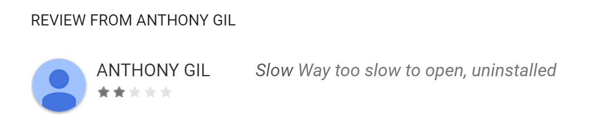

欢迎使用 **{小书匠}(xiaoshujiang)编辑器**，您可以通过==设置==里的修改模板来改变新建文章的内容。

随着安卓平台在世界范围内移动APP市场上的风靡，开发者们每天都会发布大量新的安卓APP。 2011年初， 每天已经有500多个新的安卓APP发布， 截至2015年4月，市场上发布的安卓APP总量已经超过了140万个， 而且Google Play商店的APP下载量达到了1250亿次。 毫无疑问，安卓APP的市场仍将继续增长。

然而，大部分APP都存在严重的卡顿和延迟，导致用户体验急剧下降。 CompuWare的一项研究调查 显示，56%的用户都在过去的6个月内遇见过手机APP的问题，将近47%的用户表示APP启动速度太慢，此外， 超过60%的用户反映他们使用的APP出现过崩溃，无响应，或者其他不应出现的问题。这项调查还认为， 在手机APP中，安卓APP的性能问题比iOS APP更加严重，因为安卓APP的运行环境是基于Java语言， 在低端手机上其解释执行效率较低。

不幸的是，用户对APP的卡顿现象几乎是零容忍的： AppDynamics报道称，86%的用户都会因为首次运行APP时的卡顿而将其卸载， 而另一项JWPlayer的研究调查表明 70%的观众都会在等待（视频）内容加载超过11秒后关闭APP。 显然，卡顿的APP会让用户非常不满。下面是ABC News APP用户评论中的一条：

译：启动太慢，果断卸载。Google Play商店上大量这样的差评，会使得很多潜在用户不会下载你的APP。
用户不满的后果远不止于卸载APP：糟糕的用户体验会导致用户在Google Play商店中留下差评， 这将会导致用户不去下载这个开发者开发的其他APP。实际上， 84%的用户都会在决定是否下载APP时参考该APP的评分。

在网站开发领域中，开发者都知道性能是决定网站是否能成功的关键因素（例如，Amazon称 100毫秒的额外延迟将会降低高达1%的销售额）， 而移动APP开发者最近才开始意识到这一规律，行业巨头正在迅速迎头赶上， 为优化移动APP的性能投入了更多的时间和资源。他们深知这是他们成功的关键：这就是 Instagram开发者耗费一年时间优化他们的安卓APP的原因。 我们分析了4款非常流行的APP：Facebook，LinkedIn，Yahoo News Digest和微信， 发现这些APP中都存在大量性能检测的代码。其中透露的信息是普适的：性能至关重要！

总结一下，APP的性能绝对是非常重要的。移动APP领域中，流畅的性能是APP成功的关键。 性能良好的APP会吸引用户，让用户满意，用户会因此留下五星好评，而这又会带来更多的用户， 从而提升品牌知名度，让你的APP从竞品中脱颖而出，进而带来更多的收益（钱钱钱 ） :) 。